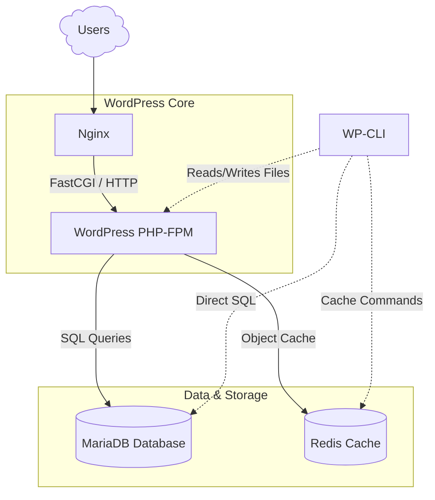
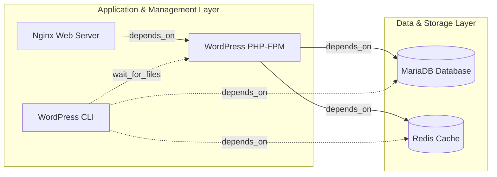
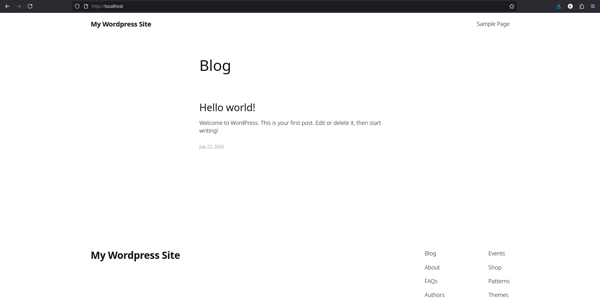

<div align="center">
  <picture>
    <source media="(prefers-color-scheme: dark)" srcset="../images/docker-logo-white.svg">
    <source media="(prefers-color-scheme: light)" srcset="../images/docker-logo-black.svg">
    
  </picture>
</div>

# WordPress Stack

## :dart: Objective

This project aims to demonstrate a modern, lightweight **WordPress** development environment in **Docker**, fully orchestrated using **Docker Compose**.

It is designed as an efficient local stack for PHP development, showcasing best practices in container isolation, developer experience (DX), and automated service management via a custom `Makefile`.

## :building_construction: Stack Overview

The stack isolates core components into dedicated, lightweight containers:

- **Application**: WordPress running on `PHP-FPM` (Alpine Linux).
- **Web Server**: Nginx (serving static files & reverse-proxying PHP requests).
- **Database**: MariaDB (optimized relational storage).
- **Object Cache**: Redis (reducing database queries for dynamic content).
- **CLI Tooling**: WP-CLI via an interactive container environment for administration tasks.

## :world_map: Service Flow Architecture Diagram



## :deciduous_tree: Docker Dependency Graph



## :arrow_forward: Getting Started

**NOTE**: This stack runs locally over `HTTP` by design to minimize setup friction and ensure immediate testing for reviewers without requiring local CA/SSL installations.

### :clipboard: Pre-requisites

Make sure you have the following tools installed on your host machine:

- **Docker Engine**: Version `29.6.2` or higher recommended.
- **Docker Compose**: Version `v5.3.1` or higher recommended.
- **GNU Make**: Pre-installed on macOS/Linux (used for shorthand commands).

### :gear: Installation & Setup

1. Create Secret Files

   Generate the required password files for MariaDB and WordPress to keep sensitive data secure:
   ```bash
   echo -n "YourPasswordHere!" > db_root_password.txt
   echo -n "YourPasswordHere!" > db_password.txt
   echo -n "YourPasswordHere!" > wp_admin_password.txt
   ```
   **Note**: Replace "YourPasswordHere!" with your desired secure passwords.
2. Update Your Hosts File

   Map your local domain name to `127.0.0.1` so you can access the site locally:
   ```bash
   sudo nano /etc/hosts
   ```
   For example, if my local domain name is `wordpress.local`, add the following entry:
   ```text
   127.0.0.1    localhost wordpress.local
   ```
3. Environment Configuration

   Copy the example environment file and adjust the values according to your setup:
   ```bash
   cp .env.example .env
   ```
   Open `.env` and customize the values for your setup.
4. Run the Stack

   Start all services in detached mode using Makefile:
   ```bash
   make up
   ```
   (Alternatively, if not using make: `docker compose up -d`)
5. Verify the Installation

   Once the containers are running, open your browser and navigate to:
   ```bash
   http://localhost
   ```
   You should see the WordPress home:

   <div align="center">
     
   </div>

   You can access the WordPress administration:
   ```bash
   http://localhost/wp-admin
   ```
6. Clean Up

   Stop and remove the containers and networks:
   ```bash
   make down
   ```
   Remove the volumes:
   ```bash
   make clean
   ```
