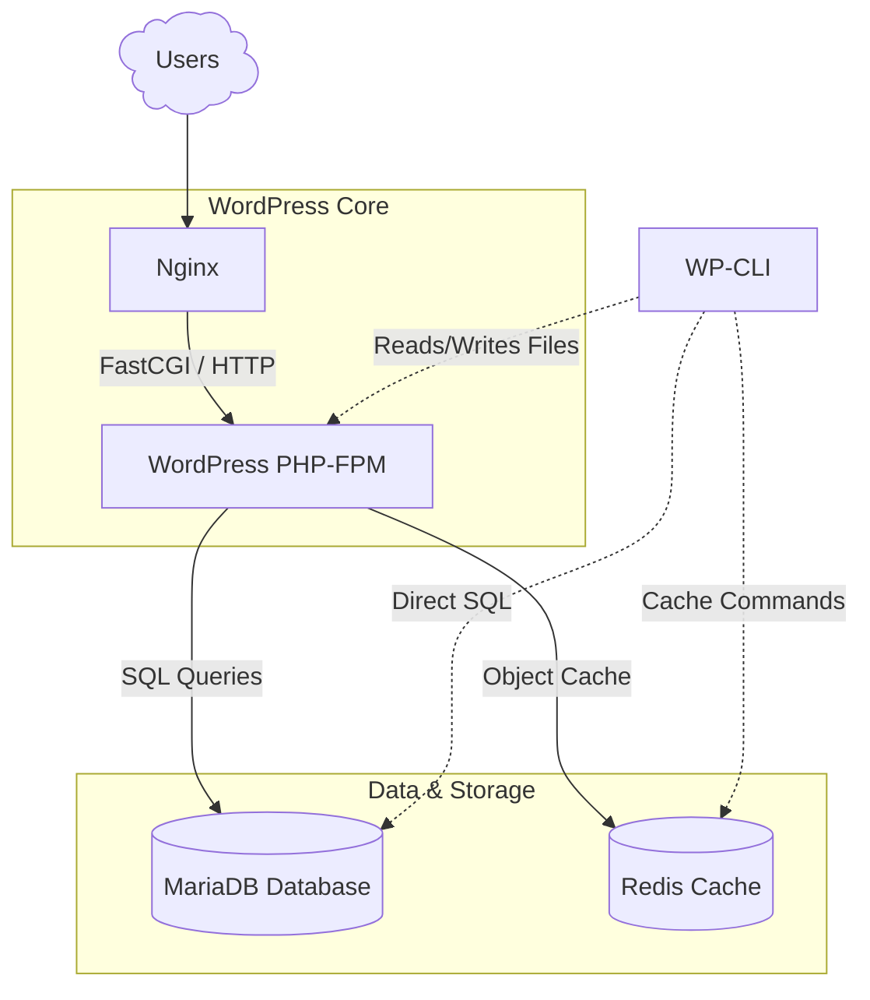

  <picture>
    <source media="(prefers-color-scheme: dark)" srcset="../images/docker-logo-white.svg">
    <source media="(prefers-color-scheme: light)" srcset="../images/docker-logo-black.svg">
    
  </picture>

# WordPress Stack

## :dart: Objective

This project aims to demonstrate a modern, lightweight **WordPress** development environment in **Docker**, fully orchestrated using **Docker Compose**.

It is designed as an efficient local stack for PHP development, showcasing best practices in container isolation, developer experience (DX), and automated service management via a custom `Makefile`.

## :building_construction: Stack Overview

The stack isolates core components into dedicated, lightweight containers:

- **Application**: WordPress running on `PHP-FPM` (Alpine Linux).
- **Web Server**: Nginx (serving static files & reverse-proxying PHP requests).
- **Database**: MariaDB (optimized relational storage).
- **Object Cache**: Redis (reducing database queries for dynamic content).
- **CLI Tooling**: WP-CLI via an interactive container environment for administration tasks.

## :world_map: Architecture Diagrams

### Service Flow Architecture

## :arrow_forward: How to Run

**NOTE**: This stack runs locally over `HTTP` by design to minimize setup friction and ensure immediate testing for reviewers without requiring local CA/SSL installations.

### Pre-requisites

Make sure you have the following tools installed on your host machine:

- **Docker Engine**: Version `29.6.2` or higher recommended.
- **Docker Compose**: Version `v5.3.1` or higher recommended.
- **GNU Make**: Pre-installed on macOS/Linux (used for shorthand commands).
